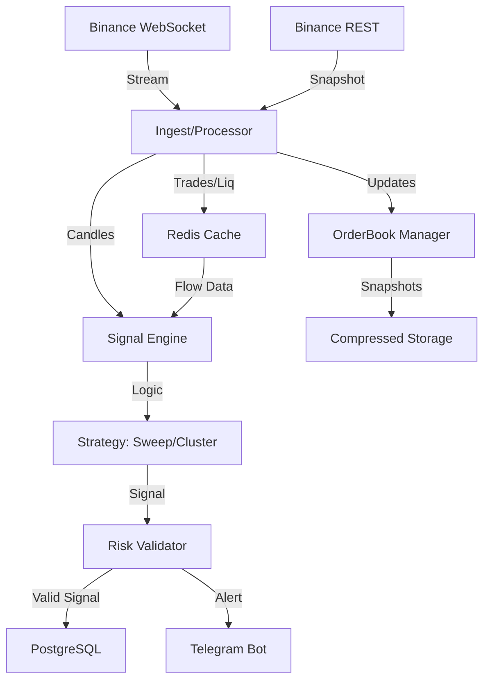

# Autonomous ETH Futures Signal Engine

A production-grade, containerized trading signal engine for ETHUSDT Futures using Binance public data. Designed for stability, low resource usage (2GB RAM), and autonomous operation.

## Features
- **Real-time Data Ingestion**: Async WebSocket connection to Binance Futures (`depth`, `aggTrade`, `forceOrder`, `kline`).
- **Professional Signals**:
  - **Liquidity Sweeps**: Detects manipulation at key levels.
  - **Order Flow Confirmation**: Uses CVD and Orderbook absorption.
  - **Liquidation Clusters**: Identifies targets based on forced liquidations.
- **Robust Storage**:
  - **Snapshot Manager**: Gzip-compressed orderbook snapshots with auto-cleanup (200MB cap).
  - **Redis**: Sliding windows for trade flow and liquidations.
  - **PostgreSQL**: Durable storage for signals and logs.
- **Risk Management**:
  - Dynamic position sizing (Risk % of Capital).
  - ATR-based Stop Loss.
  - Execution validation (MinQty, Notional, Circuit Breakers).
- **Notifications**: Real-time Telegram alerts.

## Architecture


## Quick Start

### Prerequisites
- Docker & Docker Compose
- Telegram Bot Token (optional but recommended)

### Installation
1. Clone the repository.
2. Create `.env` file:
   ```bash
   cp .env.example .env
   # Edit .env with your settings (Telegram keys, Risk %)
   ```
3. Build and Run:
   ```bash
   docker-compose up --build -d
   ```

### Monitoring
- Check logs: `docker-compose logs -f app`
- Check DB: Connect to port 5432 (User/Pass in .env)

## Configuration
Key settings in `.env`:
- `SYMBOL`: Trading pair (default: ETHUSDT)
- `INITIAL_RISK_PCT`: Risk per trade (default 1.0%)
- `SNAPSHOT_MAX_STORAGE_BYTES`: Max disk usage for snapshots.

## Directory Structure
- `src/ingest`: WebSocket & Data processing.
- `src/orderbook`: Local book management & snapshots.
- `src/signal_engine`: Core strategy logic (Sweeps, Clusters).
- `src/risk_manager`: Sizing & Validation.
- `src/utils`: DB, Redis, Logging.

## Development
Run tests:
```bash
python3 -m unittest discover tests
```
